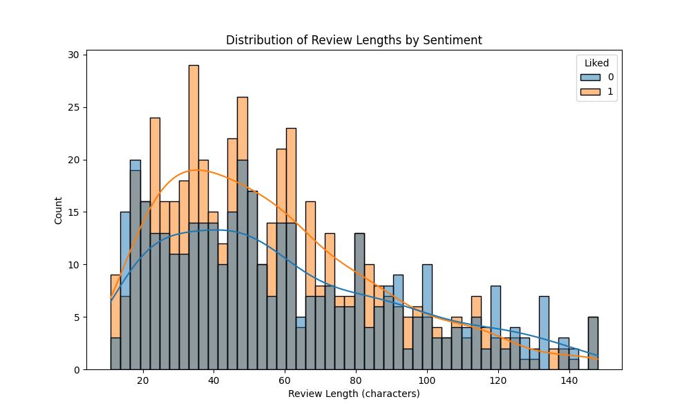

# 🍽️ Restaurant Review Sentiment Analysis

<div align="center">


</div>

A comprehensive sentiment analysis system for restaurant reviews with MLflow integration and a Streamlit web interface. This project demonstrates a complete machine learning pipeline from data preprocessing to model deployment.

<div align="center">

</div>

## 📊 Project Overview

This project analyzes restaurant reviews to determine whether they express positive or negative sentiment. It implements a full ML pipeline including:

- **Text preprocessing** with multiple configurable options
- **Feature extraction** using TF-IDF and Count Vectorization
- **Model training** with 8 different ML algorithms
- **Model tracking and versioning** with MLflow
- **Interactive web interface** with Streamlit

## ✨ Key Features

- **Advanced Text Preprocessing**:

  - Stemming/lemmatization options
  - Negation handling
  - Punctuation preservation
  - Emoticon detection
- **Comprehensive Model Evaluation**:

  - Multiple metrics (Accuracy, Precision, Recall, F1-Score, ROC-AUC)
  - Comparative analysis across models
  - Hyperparameter tuning
- **MLflow Integration**:

  - Experiment tracking
  - Model versioning
  - Model registry
  - Deployment management
- **Interactive Streamlit App**:

  - Real-time sentiment prediction
  - Visual feedback with emoji generation
  - Preprocessing details display

## 🖼️ Visualizations

<div align="center">
<table>
  <tr>
    <td></td>
    <td></td>
  </tr>
  <tr>
    <td align="center"><em>Model Performance Comparison</em></td>
    <td align="center"><em>Most Frequent Words by Sentiment</em></td>
  </tr>
  <tr>
    <td></td>
    <td></td>
  </tr>
  <tr>
    <td align="center"><em>SVM ROC Curve (Best Model)</em></td>
    <td align="center"><em>Logistic Regression ROC Curve</em></td>
  </tr>
</table>
</div>

## 📋 Model Performance

After testing multiple preprocessing configurations and models, the best performing model was:

| Model           | Accuracy | Precision | Recall | F1 Score | ROC AUC |
| --------------- | -------- | --------- | ------ | -------- | ------- |
| SVM with TF-IDF | 81.11%   | 83.87%    | 79.59% | 81.68%   | 0.913   |

Hyperparameters:

- C: 10
- gamma: 1
- kernel: rbf

## 🗂️ Project Structure

```
├── app.py                      # Streamlit web application
├── mlflow_setup.py            # MLflow configuration script
├── train_and_register_model.py # Script to train and register model with MLflow
├── sentiment_analysis.py       # Full sentiment analysis pipeline
├── predict_sentiment.py        # Utility for making predictions
├── Restaurant_reviews.tsv      # Training dataset
├── Restaurant_reviews_test.tsv # Test dataset
├── requirements.txt            # Project dependencies
├── models/                     # Saved model files
│   ├── best_sentiment_model.pkl # Serialized model
│   ├── vectorizer.pkl          # Serialized vectorizer
│   └── preprocessing_config.json # Preprocessing configuration
├── mlruns/                     # MLflow tracking directory
├── eda/                        # Exploratory data analysis visualizations
├── figures/                    # Performance visualizations
└── roc_curves/                 # ROC curve visualizations
```

### Key Files Explained

- **app.py**: Streamlit web interface for real-time sentiment prediction
- **mlflow_setup.py**: Sets up MLflow tracking and model registry
- **train_and_register_model.py**: Trains a model and registers it with MLflow
- **sentiment_analysis.py**: Comprehensive pipeline for model comparison and evaluation
- **predict_sentiment.py**: Utility for making predictions with trained models

## 📱 Application UI

<div align="center">
<table>
  <tr>
    <td></td>
    <td></td>
  </tr>
  <tr>
    <td align="center"><em>Streamlit App - Positive Review Analysis</em></td>
    <td align="center"><em>Streamlit App - Negative Review Analysis</em></td>
  </tr>
  <tr>
    <td colspan="2"></td>
  </tr>
  <tr>
    <td colspan="2" align="center"><em>About Model Section - Showing Model Details</em></td>
  </tr>
</table>
</div>

## 📊 MLflow Tracking

<div align="center">
<table>
  <tr>
    <td></td>
    <td></td>
  </tr>
  <tr>
    <td align="center"><em>MLflow Experiments Dashboard</em></td>
    <td align="center"><em>MLflow Run Details with Metrics</em></td>
  </tr>
  <tr>
    <td colspan="2"></td>
  </tr>
  <tr>
    <td colspan="2" align="center"><em>MLflow Model Registry - Showing Model Versions and Stages</em></td>
  </tr>
</table>
</div>

## 🚀 Getting Started

### Prerequisites

Install the required packages:

```bash
pip install -r requirements.txt
```

### Training the Model

```bash
python train_and_register_model.py
```

This script will:

1. Load and preprocess the restaurant review dataset
2. Train an SVM model with TF-IDF vectorization
3. Register the model with MLflow
4. Save model artifacts for local use

### Starting the MLflow UI

```bash
mlflow ui --backend-store-uri mlruns
```

Access the MLflow dashboard at http://localhost:5000

### Running the Streamlit App

```bash
streamlit run app.py
```

Access the web app at http://localhost:8501

## 🔍 Methodology

1. **Data Loading and EDA**:

   - Analysis of dataset structure and sentiment distribution
   - Visualization of review length distributions and word frequencies
2. **Text Preprocessing**:

   - Tokenization and stopword removal
   - Optional stemming or lemmatization
   - Preservation of negation words and sentiment-indicating punctuation
3. **Feature Extraction**:

   - TF-IDF vectorization (best performing)
   - Count vectorization (alternative approach)
4. **Model Training and Evaluation**:

   - Training of 8 different classification models
   - Evaluation using multiple metrics
   - ROC curve analysis
5. **Hyperparameter Tuning**:

   - Grid search for optimal parameters
   - Cross-validation to prevent overfitting
6. **MLflow Integration**:

   - Tracking of experiments, parameters, and metrics
   - Model versioning and registry
   - Deployment to production stage
7. **Streamlit App Development**:

   - Interactive web interface
   - Real-time prediction
   - Visual feedback with custom emoji generation

## 📈 Results

The SVM model with TF-IDF vectorization and optimized preprocessing (stemming=True, lemmatization=False, keep_negation=True, keep_punctuation=True) achieved the best performance with 81.11% accuracy and 81.68% F1 score.

The model successfully captures the sentiment of restaurant reviews and can be used to automatically analyze customer feedback.

## 🤝 Contributing

Contributions are welcome! Please feel free to submit a Pull Request.

## 📄 License

This project is licensed under the MIT License - see the LICENSE file for details.

## 📧 Contact

For any questions or feedback, please reach out to kasi[.majji24@gmail.com](mailto:your-email@example.com).

---

<div align="center">

[](https://github.com/yourusername)

</div>
